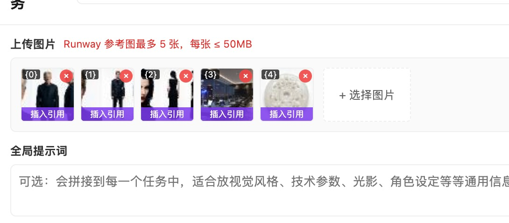
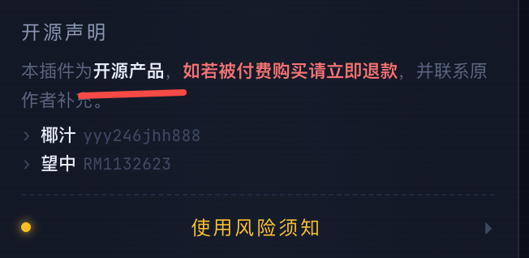

<div align="center">
  

  <h1>Seedance Runway</h1>

  <p>多平台 AI 视频批量生成助手 · 即梦 + Runway 双平台挂机 · MV3 Chrome 扩展</p>

  <p>
    
    
    
  </p>
</div>

---

## 截图

| 任务表单 | 主控台底部 |
|---|---|
|  |  |
| 多平台表单切换、参考图最多 15 张 | 开源声明 + 风险提示 + 更新日志（v1.0.7+ 已升级三色卡片） |

> 完整截图集仍在补充。装好后侧边栏的 Operations Terminal 视觉效果建议自己跑一次看。

---

## 核心特性

- 双平台批量调度：即梦 3 并发 + Runway 2 并发同时跑，互不阻塞
- 挂机模式：开启后新建任务自动派发，到上限排队，完成自动续派
- Runway 寄生轮询：用户开着 Runway 页时，后台请求量近乎归零（白嫖页面自身的 GET）
- 反检测加固：自动注入官方 Web 端指纹头（X-Runway-Client-Id / Source-Application / Version / Workspace），轮询间隔 ±25% 抖动，提交间随机 3-8s
- 每日 80 条硬上限：Runway 单日累计提交达 80 条自动停止派发，规避账号风控
- 凭证自动抓取：用 chrome.webRequest 监听 Runway 域，JWT / teamId / assetGroupId / fingerprint 全部自动落库，无需手填
- 任务持久化：所有任务、进度、结果存 chrome.storage.local，关浏览器再开继续
- 侧边栏主控台：暗紫黑配色，JetBrains Mono 字体

## 安装

未上架 Chrome 应用商店，需要开发者模式手动加载：

1. 下载最新 [Releases](../../releases) 里的 `ShopLoopAI-vX.X.X.zip` 并**解压**
2. 浏览器打开 `chrome://extensions/`
3. 右上角打开「开发者模式」
4. 点「加载已解压的扩展程序」，选刚解压的目录
5. 钉到工具栏 → 点扩展图标打开 popup，或点「打开主控台」进入侧边栏

> Chrome 启动时会显示「正在停用开发者模式扩展程序」黄条提示，正常现象，点 X 关掉即可继续使用。

## 使用

**即梦路径**

1. 登录 https://jimeng.jianying.com/
2. 点扩展「+ 新建任务」，平台选「即梦」，填提示词、选模型、上传参考图
3. 主控台开「挂机模式」，任务自动跑

**Runway 路径**

1. 登录 https://app.runwayml.com/，让页面跑一会儿（插件自动抓凭证）
2. 点扩展「+ 新建任务」，平台选「Runway」，填提示词、选模型 / 时长 / 分辨率 / 参考图
3. 主控台开「挂机模式」即可
4. 建议保持 Runway 标签页打开 —— 启用寄生模式可大幅减少后台请求量

## 风险须知

本插件本质上是对官方平台的脚本化调用，严格按 ToS 字面解释属于违规。已做缓解：

- 自动注入 Runway 官方 Web 端指纹头
- 轮询 / 提交间隔随机抖动
- 寄生页面轮询，后台请求量大幅降低
- 单日 80 条硬上限

仍无法消除的风险：

- 请求 Origin 始终是 `chrome-extension://...`，浏览器层面无法伪装
- 多并发持续挂机的产能仍显著高于真人
- Credits 异常消耗本身就会触发风控复查

强烈建议：

- 主账号 / 挂机账号分离
- 分散时段使用，避免 24h 不间断
- 多账号轮换
- 出现持续 THROTTLED / 403 / 风控验证立即停止

> 本插件仅供学习与团队内部使用，由此产生的任何账号风险由使用者自行承担。

## 架构

```
ShopLoopAI/
├── manifest.json              # MV3 manifest
├── background.js              # Service Worker：BatchManager + 消息分发
├── popup.html / popup.js      # 任务监控面板
├── sidepanel.html / .js       # 主控台（Operations Terminal）
├── add_task.html / .js        # 新建任务表单
├── core/                      # 平台无关的批量调度内核
├── platforms/
│   ├── base.js                # Platform 契约基类
│   ├── registry.js            # 平台注册中心
│   ├── jimeng/                # 即梦：DOM 自动化路径
│   └── runway/                # Runway：headless REST 路径
│       ├── transport.js       # JWT + 指纹头注入
│       ├── submit.js          # 4 步上传链 + 提交 + 轮询
│       ├── monitor.js         # 平台监控
│       ├── form-schema.js     # 表单字段定义
│       ├── config.js          # 端点 / 模型 / 状态映射
│       ├── page-harvester.js  # content script
│       └── page-harvester-inject.js  # 页面注入：凭证 + 寄生轮询
├── image-store.js             # IndexedDB 图片存储
└── styles/                    # 共享样式
```

## 二次开发

```bash
git clone https://github.com/yejunhao159/seedance-runway.git
cd seedance-runway
# 直接「加载已解压的扩展程序」即可，所有改动 chrome://extensions 点刷新生效
```

新增第三个平台 = 在 `platforms/` 下新建目录，实现 Platform 契约（monitor / submitter / form-schema / config），到 `registry.js` 注册——核心调度器无需任何改动。

## 更新日志

详见侧边栏底部「更新日志」面板，或 [GitHub Releases](../../releases)。

---

## 关于作者

本工具由 **椰汁** 开发，合作者 **望中**。

| 角色 | 名字 | 微信 |
|---|---|---|
| 作者 | 椰汁 | `yyy246jhh888` |
| 合作 | 望中 | `RM1132623` |

平时在做两个聚焦小红书 AI 运营的产品：

**ShopAgent** — 桌面端小红书运营研究工具，用 KFS 方法论（关键词 · 爆款 · 供给侧）拆解爆款。技术栈 Tauri 2 + React 18，本地 SQLite，AI Agent 内置。

**[shoploopai.com](https://shoploopai.com)** — 小红书多账号矩阵全自动运营 + 跨平台数据中台。

这个开源插件是做 ShopLoop 过程中抽出来的「视频素材批量生成」一环，原本是内部工具，整理后放出来。如果你也在做小红书相关的工作，欢迎加微信聊聊（备注「Seedance Runway」）。

---

> 本仓库 MIT 开源免费。如发现被付费售卖请申请退款，并联系上方微信获取原版本。

## License

MIT — 商业使用、修改、再发布均可，但请保留 LICENSE 与作者署名。
